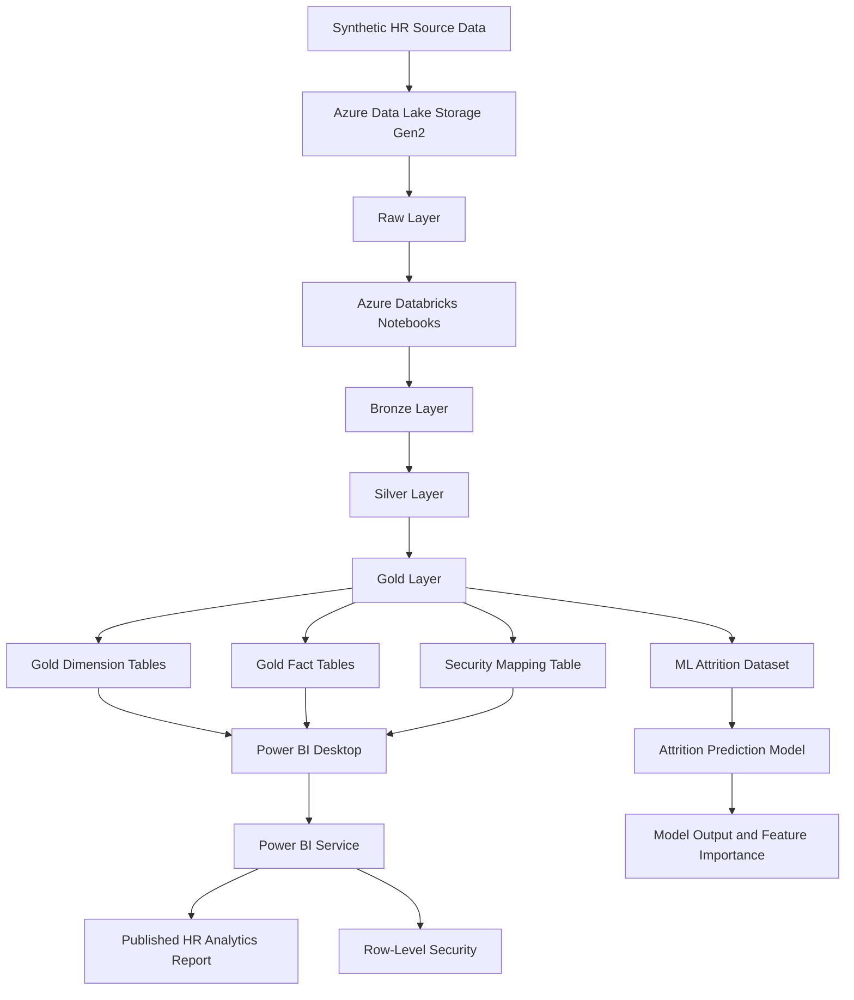

# Solution Architecture  
## Enterprise Workforce Intelligence Platform

---

## 1. Architecture Overview

The Enterprise Workforce Intelligence Platform follows a cloud-based Lakehouse architecture for HR analytics.

The solution is designed to simulate how a modern organisation can collect, store, transform, model, analyse, and securely publish workforce data using Azure Data Lake Storage Gen2, Azure Databricks, Delta-style data layers, Power BI Desktop, Power BI Service, and Row-Level Security.

The architecture follows the medallion data design pattern:

```text
Raw Layer
  → Bronze Layer
  → Silver Layer
  → Gold Layer
```

Each layer improves the quality and usability of the data.

The final Gold layer is used for:

- Power BI reporting
- SQL analysis
- HR dashboarding
- Row-Level Security
- Attrition prediction modelling

---

## 2. High-Level Architecture

```text
Synthetic HR Source Data
        ↓
Azure Data Lake Storage Gen2
        ↓
Raw Layer
        ↓
Azure Databricks
        ↓
Bronze Layer
        ↓
Silver Layer
        ↓
Gold Layer
        ↓
Databricks SQL / Gold Reporting Tables
        ↓
Power BI Desktop
        ↓
Power BI Service
        ↓
Published Report with Row-Level Security
```

---

## 3. Architecture Diagram



---

## 4. Main Architecture Components

| Component | Purpose |
|---|---|
| Synthetic HR Data | Simulates source data from HR, payroll, attendance, recruitment, training, performance, and attrition systems |
| Azure Data Lake Storage Gen2 | Stores Raw, Bronze, Silver, and Gold data layers |
| Raw Layer | Stores original source files without transformation |
| Azure Databricks | Performs ingestion, cleaning, transformation, modelling, and analytical processing |
| Bronze Layer | Stores standardised ingested data |
| Silver Layer | Stores cleaned and validated data |
| Gold Layer | Stores reporting-ready dimensional tables and analytical datasets |
| Databricks SQL / Gold Tables | Provides queryable reporting layer for analytics and Power BI |
| Power BI Desktop | Used to build data model, DAX measures, and report visuals |
| Power BI Service | Used to publish, share, and secure the report |
| Row-Level Security | Restricts report data based on the logged-in user |
| Machine Learning Model | Predicts employee attrition risk using HR features |

---

## 5. Data Flow

The data flow has six major stages.

---

### 5.1 Source Data Generation

Synthetic HR datasets are generated to represent a fictional organisation.

Planned source files include:

```text
employees.csv
payroll.csv
attendance.csv
leave.csv
recruitment.csv
training.csv
performance.csv
attrition.csv
security_mapping.csv
```

These datasets represent different HR business areas.

| Source File | Business Area |
|---|---|
| employees.csv | Employee master data |
| payroll.csv | Salary, bonus, pay grade, and salary band |
| attendance.csv | Working days, present days, absence days, and late arrivals |
| leave.csv | Annual leave, sick leave, and unpaid leave |
| recruitment.csv | Candidate applications, offers, hires, and time to hire |
| training.csv | Training courses, completion status, and training hours |
| performance.csv | Review ratings, review periods, and promotions |
| attrition.csv | Employee exit details and exit reasons |
| security_mapping.csv | User access mapping for Power BI RLS |

---

### 5.2 Raw Layer

The Raw layer stores the original source files exactly as generated.

Example structure:

```text
data/raw/employees.csv
data/raw/payroll.csv
data/raw/attendance.csv
data/raw/leave.csv
data/raw/recruitment.csv
data/raw/training.csv
data/raw/performance.csv
data/raw/attrition.csv
data/raw/security_mapping.csv
```

Purpose of the Raw layer:

- Preserve original source data.
- Support traceability.
- Allow reprocessing if required.
- Avoid applying business rules too early.
- Keep source files separate from cleaned data.

---

### 5.3 Bronze Layer

The Bronze layer stores standardised ingested data.

Typical Bronze transformations:

- Load raw files.
- Standardise column names.
- Add ingestion timestamp.
- Add source file name.
- Ensure consistent data types where possible.
- Preserve detailed row-level data.

Example Bronze outputs:

```text
bronze_employees
bronze_payroll
bronze_attendance
bronze_leave
bronze_recruitment
bronze_training
bronze_performance
bronze_attrition
bronze_security_mapping
```

The Bronze layer is not fully cleaned. It mainly provides a consistent ingested version of the raw data.

---

### 5.4 Silver Layer

The Silver layer stores cleaned, validated, and business-ready data.

Typical Silver transformations:

- Remove duplicate records.
- Handle missing values.
- Standardise department names.
- Standardise location names.
- Standardise job role values.
- Validate employee IDs.
- Validate date fields.
- Fix invalid date relationships.
- Clean salary and attendance values.
- Prepare datasets for dimensional modelling.

Example Silver outputs:

```text
silver_employees
silver_payroll
silver_attendance
silver_leave
silver_recruitment
silver_training
silver_performance
silver_attrition
silver_security_mapping
```

The Silver layer is the trusted clean data layer.

---

### 5.5 Gold Layer

The Gold layer stores reporting-ready tables.

The Gold layer will follow a dimensional model with dimensions and facts.

Planned dimension tables:

```text
dim_employee
dim_department
dim_job_role
dim_location
dim_date
dim_manager
dim_security_user
```

Planned fact tables:

```text
fact_payroll
fact_attendance
fact_leave
fact_recruitment
fact_training
fact_performance
fact_attrition
```

Additional analytical output:

```text
ml_attrition_dataset
```

The Gold layer is the main source for Power BI and SQL reporting.

---

### 5.6 Power BI and Reporting Layer

Power BI Desktop connects to the Gold layer tables.

Power BI is used to build:

- Data model relationships
- DAX measures
- Report pages
- Interactive filters
- Drill-through analysis
- KPI cards
- Workforce dashboards
- Attrition prediction visuals
- Row-Level Security roles

The completed report is then published to Power BI Service.

---

## 6. Data Lake Folder Structure

The planned Azure Data Lake folder structure is:

```text
/workforce-intelligence/
│
├── raw/
│   ├── employees/
│   ├── payroll/
│   ├── attendance/
│   ├── leave/
│   ├── recruitment/
│   ├── training/
│   ├── performance/
│   ├── attrition/
│   └── security_mapping/
│
├── bronze/
│   ├── employees/
│   ├── payroll/
│   ├── attendance/
│   ├── leave/
│   ├── recruitment/
│   ├── training/
│   ├── performance/
│   ├── attrition/
│   └── security_mapping/
│
├── silver/
│   ├── employees/
│   ├── payroll/
│   ├── attendance/
│   ├── leave/
│   ├── recruitment/
│   ├── training/
│   ├── performance/
│   ├── attrition/
│   └── security_mapping/
│
└── gold/
    ├── dim_employee/
    ├── dim_department/
    ├── dim_job_role/
    ├── dim_location/
    ├── dim_date/
    ├── dim_manager/
    ├── dim_security_user/
    ├── fact_payroll/
    ├── fact_attendance/
    ├── fact_leave/
    ├── fact_recruitment/
    ├── fact_training/
    ├── fact_performance/
    ├── fact_attrition/
    └── ml_attrition_dataset/
```

---

## 7. Databricks Notebook Design

The Databricks implementation will be divided into separate notebooks.

| Notebook | Purpose |
|---|---|
| 01_ingestion_raw_to_bronze | Load Raw source files and create Bronze tables |
| 02_bronze_to_silver | Clean and validate Bronze data into Silver tables |
| 03_silver_to_gold | Create Gold dimension and fact tables |
| 04_data_quality_checks | Validate records, keys, dates, and business rules |
| 05_sql_analytics | Run analytical SQL queries on Gold tables |
| 06_attrition_model | Build and evaluate attrition prediction model |

---

## 8. Power BI Report Architecture

Power BI will use the Gold layer as the reporting source.

The planned model will include:

```text
Dimension tables
        ↓
Fact tables
        ↓
DAX measures
        ↓
Report pages
        ↓
Power BI Service
        ↓
RLS-secured report access
```

---

### 8.1 Planned Power BI Pages

| Page | Purpose |
|---|---|
| Executive Overview | High-level HR KPIs and workforce trends |
| Workforce Demographics | Employee distribution by department, location, role, gender, and work mode |
| Attrition Analysis | Attrition trends and leaver profile |
| Recruitment Analysis | Hiring funnel, time to hire, and source effectiveness |
| Attendance and Leave | Absence, leave usage, and department comparison |
| Payroll Analysis | Salary cost, average salary, and salary distribution |
| Training and Performance | Training completion and performance ratings |
| Attrition Prediction | Attrition risk groups and model drivers |

---

## 9. Row-Level Security Architecture

The project will implement dynamic Row-Level Security in Power BI.

RLS will be based on a security mapping table that connects user email addresses to authorised departments and locations.

Example security table:

| User Email | Access Type | Department | Location |
|---|---|---|---|
| hr.director@abcglobal.com | ALL | ALL | ALL |
| manager.sales@abcglobal.com | DEPARTMENT | Sales | ALL |
| manager.finance@abcglobal.com | DEPARTMENT | Finance | ALL |
| manager.london@abcglobal.com | LOCATION | ALL | London |
| manager.manchester@abcglobal.com | LOCATION | ALL | Manchester |

---

### 9.1 RLS Logic

The RLS design will support:

- Full access for HR leadership.
- Department-level access for department managers.
- Location-level access for location managers.
- Restricted access for specific users.

The Power BI model will use the logged-in user email to filter data.

Example concept:

```DAX
USERPRINCIPALNAME()
```

This allows the report to identify the current Power BI Service user and apply the correct filter based on the security mapping table.

---

### 9.2 RLS Testing Scenarios

| Test User | Expected Access |
|---|---|
| hr.director@abcglobal.com | All departments and all locations |
| manager.sales@abcglobal.com | Sales department only |
| manager.finance@abcglobal.com | Finance department only |
| manager.london@abcglobal.com | London location only |
| manager.manchester@abcglobal.com | Manchester location only |

RLS will be tested in Power BI Desktop using “View as role” and in Power BI Service after publishing.

---

## 10. Security Considerations

The project will follow these security principles:

- No real employee data will be used.
- All HR data will be synthetic.
- Credentials will not be committed to GitHub.
- Azure access keys will not be stored in project files.
- Power BI Row-Level Security will restrict report visibility.
- Sample user emails will be fictional.
- Power BI Service access will be documented.
- RLS testing screenshots will be stored for documentation.

---

## 11. Cost Control Considerations

Because Azure resources can create costs, the project will follow cost-control practices.

Cost-control actions:

- Use a small synthetic dataset.
- Use small development Databricks compute.
- Enable auto-termination on Databricks clusters.
- Stop compute when not in use.
- Avoid leaving SQL warehouses running unnecessarily.
- Use budget alerts where possible.
- Delete unused resources after completing the project.
- Avoid unnecessary large-scale storage or processing.

---

## 12. Data Quality Architecture

Data quality checks will be applied across the pipeline.

| Layer | Data Quality Focus |
|---|---|
| Raw | File availability and source structure |
| Bronze | Schema consistency and ingestion metadata |
| Silver | Missing values, duplicates, invalid dates, invalid categories |
| Gold | Key relationships, measures, reporting readiness |
| Power BI | KPI validation, visual validation, RLS validation |

---

### 12.1 Planned Data Quality Checks

The project will check for:

- Missing employee IDs.
- Duplicate employee IDs.
- Invalid hire dates.
- Exit dates before hire dates.
- Missing department values.
- Invalid location values.
- Missing salary values.
- Negative salary values.
- Invalid attendance values.
- Missing performance ratings.
- Fact records without matching employee records.
- Security mapping users without valid access values.

---

## 13. Machine Learning Architecture

The project will include a basic employee attrition prediction model.

The ML dataset will be prepared from Gold-level HR features.

Possible input features:

- Age
- Tenure
- Department
- Job role
- Salary band
- Work mode
- Absence days
- Late arrivals
- Training hours
- Training completion
- Performance rating
- Promotion flag

Target variable:

```text
attrition_flag
```

The model output will include:

- Predicted attrition risk
- Model accuracy
- Confusion matrix
- Feature importance
- Business interpretation

The model will be presented as a portfolio demonstration, not as a production HR decision-making tool.

---

## 14. End-to-End Process Summary

```text
1. Generate synthetic HR source data
2. Upload source files to Raw layer
3. Load Raw files into Databricks
4. Create Bronze standardised tables
5. Clean and validate data into Silver tables
6. Create Gold dimension and fact tables
7. Run SQL analysis on Gold tables
8. Build Power BI report from Gold tables
9. Publish report to Power BI Service
10. Configure Row-Level Security
11. Test RLS access scenarios
12. Build attrition prediction model
13. Document results and screenshots
14. Prepare GitHub, CV, and interview explanation
```

---

## 15. Future Architecture Enhancements

Possible future architecture improvements include:

- Azure Data Factory orchestration.
- Scheduled Databricks workflows.
- Power BI scheduled refresh.
- Incremental refresh.
- Power BI deployment pipelines.
- Microsoft Entra group-based security.
- Object-Level Security.
- CI/CD for Databricks notebooks.
- CI/CD for Power BI assets.
- Automated data quality monitoring.
- Advanced ML model deployment.
- HR recommendation engine.